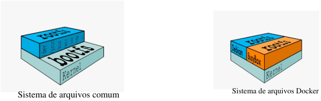
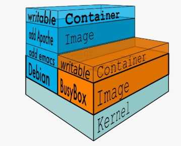

# Containers com Docker   


Repositório criado para o aprofundamento de Containers com Docker.

### O que são containers?
> Conhecidos também por Containers Linux, são uma maneira de criar ambientes isolados que podem executar código enquanto compartilham um único sistema operacional.
> 
> - Dentro de um sistema operacional podemos criar containers.
>   
> - Cada container é completamente isolado dos outros.

### O que é o Docker?
> Gerenciar containers é uma tarefa difícil.
> - É uma ferramenta que deixa a tarefa de gerenciar containers muito mais fácil.
>   
> - Docker >>> Docker Engine >>> Aplicação que gerencia containers por trás dos panos.

### Diferença de Container e Máquina Virtual
> A conteinerização torna suas aplicações portáteis, para que o mesmo código possa ser executado em qualquer dispositivo.
> 
> Uma máquina virtual é uma cópia digital de uma máquina física. Você pode ter várias máquinas virtuais com seus próprios sistemas operacionais individuais em execução no mesmo sistema operacional host. Além disso, você pode criar uma máquina virtual que contém tudo o que é necessário para executar sua aplicação.
>
> Em máquinas virtuais temos sempre que instalar um sistema operacional para a máquina virtual que está sendo criada e fazer toda a configuração deste sistema. Já em containers não precisamos instalar sistemas operacionais, pois vamos apenas utilizar um ambiente isolado com executáveis e bibliotecas úteis para a aplicação sendo executada.

## YAML - Yet Another Markup Language
### Introdução a YAML
> Criada em 2001 é uma linguagem não apenas de marcação, como o nome sugere, mas uma linguagem de Serialização de Dados.
> 
> - Serialização é uma técnica que converter objetos em bytes (colocando-os em série) e uma vez que eles são bytes, eles podem ser salvos em disco ou enviados através de um strem (via HTTP, via socket, entre outros).
>   
> 
>
> A linguagem YAML:
> - Integração com outras linguanges: Python, Ruby, Java, etc.
> - Tipos de dados comuns escalares, listas, arrays, etc.
> - Comumente utilizada como arquivo de configuração ou armazenamento de dados.
>
> Objetivos:
> - Fácil leitura;
> - Portátil;
> - Integrar facilmente com outras linguagens;
> - Fácil de implementar.
>
> ## O que são imagens em um container?
> - Uma imagem é criada a partir de um arquivo chamado Dockerfile.
>
> - São templates, modelos.
>
> - Primeiro o docker tenta encontrar uma imagem localmente e se não encontrar, então ele tenta encontrar no docker hub.
>
> - Não podemos confundir as imagens de containers com as imagens de serviço cloud como Amazon AWS, Google Cloud Plaftorm e Microsoft Azure.
>
> - Após a criação do container, ele já está funcionando.
>
> - Após criarmos um container a partir de uma imagem está imagem fica armazenada no nosso computador local. Se quiser criar um outro container com a mesma imagem não será necessário baixa-la novamente.
>
> ## Sistemas de Arquivos em Camadas
> - Filesystem é sistema de arquivo utilziado pela ferramenta.
>
> - O sistema de arquivos do Docker é chamado de Layered, ou seja, é um sistema de arquivos em camadas.
>
> ### Sistemas de arquivos
>
> Um sistema de arquivos comum (Linux/Unix), possui basicamente duas camadas:
> - bootfs: Onde fica o sistema de Boot do sistema operacional e o kernel
>
> - rootfs: Inclui o sistema de arquivos do sistema operacional, incluindo a arquitetura de diretórios, como /dev, /prov, /bin, /etc, /lib/, /usr e /tmp assim como os arquivos de configuração e bonários do sistema operacional.
>
> - Quando o sistema operacional é iniciado ele carrega o rootfs primeiramente em modo somente leitura, verifica sua integridade e em seguida remonta- como leitura/escrita e assim ficando disponível para o usuário e aplicações.
>
> - No docker a camada de escrita que o processo/aplicação visualiza não é o mesmo roofts base do sistema mas sim uma camada de abstração do rootfs. Isso faz com que um container torne-se portável, pois as modificações realizadas não são aplicadas ao sistema origem do container e sim na camada a qual o sistema visualiza.
>
> - Boofts em vez de ser único por sistema /container é compartilhado entre eles.
>
> - Roofts é isolado por camada, ou seja, o que deve ser comum entre o host e o container é compartilhado via AUFS, que monta uma camada de leitura/escrita em cima do sistema de arquivos que é somente leitura. Isso garante que modificações feitas dentro do container não afetam o sistema de arquivos do host.
>
> 
>
> Arquitetura do sistema de arquivos do Docker.
> 
> 
>
> - Imagens são compartilhadas entre containers Docker.
>
> ## Comandos importantes
> - docker container ls > listar os containers.
>
> - docker ps > lista todos os containers em execução.
>
> - docker ps - a > containers parados e em execução.
>
> - docker pull postgres > baixa imagem.
>
> - docker image ls > lista imagens do computador.
>
> - docker image rm > deletar imagem colocando id.
>
> - docker image inspect (nome ou id) > inspecionando a imagem.
>
> Se existir um container com uma imagem, não conseguimos deletar a imagem a não ser que force esse processo:
> - docker image rm (id) -f > força o delete.
>
> ## Criando um container a partir de uma imagem
> Baixando a imagem:
> - docker pull ubuntu
> 
> Criando um container a partir da imagem:
> - docker run ubuntu
>   
>
> Pedindo para escrever na saída o texto "Aprendendo Docker":
> 
>
> Lembrando: Ele não fica em execução.
>
> Observação: Quando for baixar uma imagem, tente colocar a versão ao invés de deixar só o latest para futuramente não quebra-la. Especifique-a. ``` docker pull postgres:13.1```, etc.


